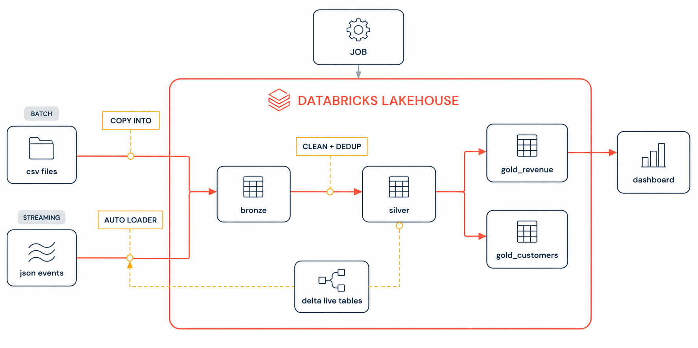
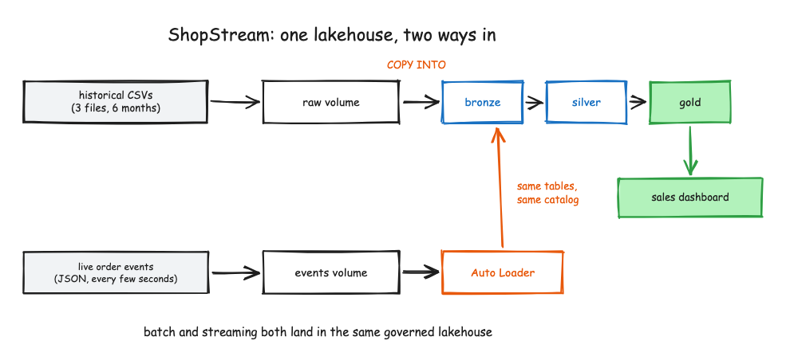
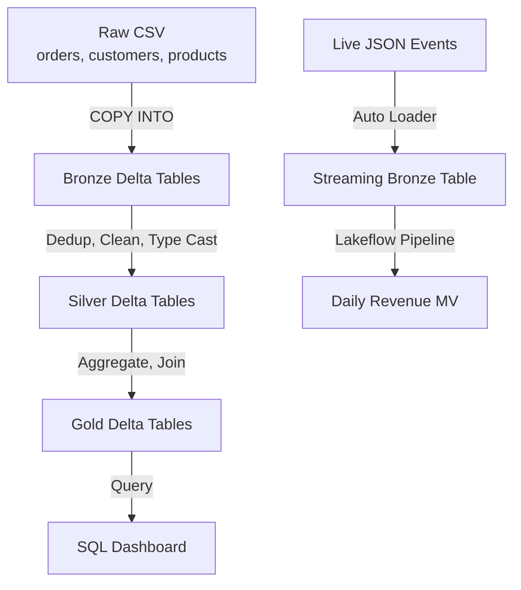
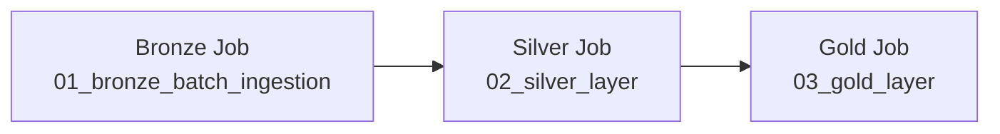
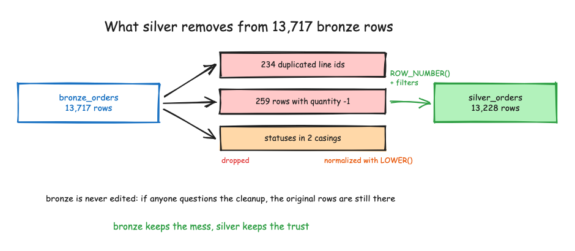
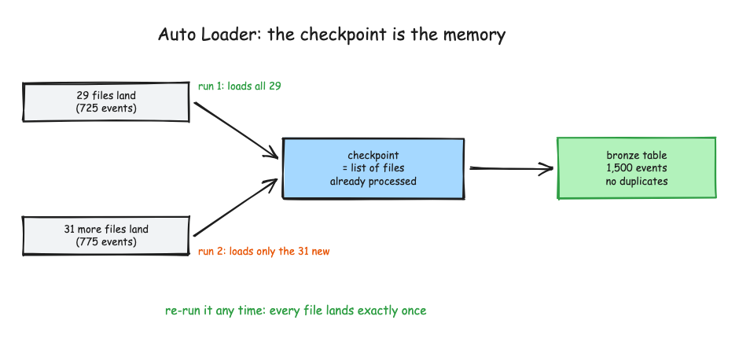
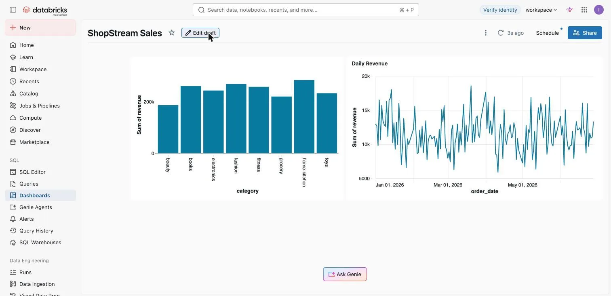
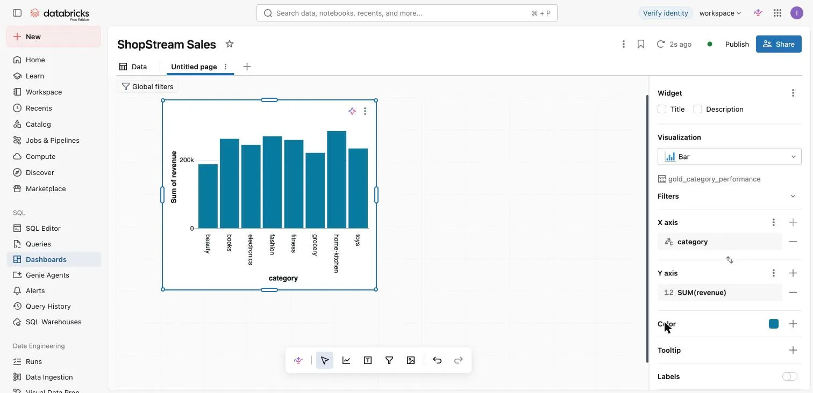
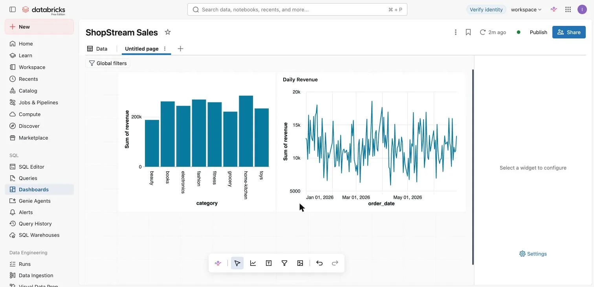

# ShopStream: End-to-End Databricks Lakehouse Project

An end-to-end e-commerce analytics pipeline built entirely on the Databricks Lakehouse platform. ShopStream ingests batch CSV data and live streaming JSON events, processes them through a medallion architecture (Bronze → Silver → Gold), and serves the results through Databricks SQL dashboards and a Lakeflow Spark Declarative Pipeline.

<p align="center">
  
</p>

<p align="center"><em>Batch and streaming sources land in one governed lakehouse, flow through the medallion layers, and end on a live sales dashboard.</em></p>

---

## Table of Contents

* [Project Overview](#project-overview)
* [Architecture](#architecture)
* [Medallion Architecture](#medallion-architecture)
* [Batch Ingestion](#batch-ingestion)
* [Bronze Layer](#bronze-layer)
* [Silver Layer](#silver-layer)
* [Gold Layer](#gold-layer)
* [Streaming Auto Loader](#streaming-auto-loader)
* [Lakeflow Declarative Pipeline](#lakeflow-declarative-pipeline)
* [Databricks Job Orchestration](#databricks-job-orchestration)
* [Dashboard](#dashboard)
* [Unity Catalog](#unity-catalog)
* [Tables](#tables)
* [Volumes](#volumes)
* [Technologies](#technologies)
* [Project Results](#project-results)
* [Data Quality Handling](#data-quality-handling)
* [Setup Instructions](#setup-instructions)
* [Repository Structure](#repository-structure)

---

## Project Overview

ShopStream is a simulated e-commerce order analytics platform. It processes order line data, customer profiles, and product catalogs through a complete data engineering pipeline on Databricks. The project demonstrates:

* **Batch ingestion** of historical CSV data using `COPY INTO`
* **Streaming ingestion** of live JSON events using Auto Loader
* **Medallion architecture** with Bronze, Silver, and Gold Delta tables
* **Data quality remediation** including deduplication, type casting, normalization, and Delta DML
* **Lakeflow Spark Declarative Pipeline** for streaming analytics
* **Lakeflow Job orchestration** for automated daily batch processing
* **Databricks SQL dashboard** for reporting
* **Unity Catalog** governance for all tables, schemas, and volumes

---

## Architecture

### One Lakehouse, Two Ways In

Historical CSVs arrive in bulk through `COPY INTO`, while live order events stream in every few seconds through Auto Loader. Both paths write to the same catalog and the same bronze tables, so everything downstream (silver, gold, and the dashboard) is shared.

<p align="center">
  
</p>

### Data Flow



### Job Orchestration



### Batch Pipeline

```text
Raw CSV
   ↓
COPY INTO
   ↓
Bronze Delta
   ↓
Silver Delta
   ↓
Gold Delta
   ↓
Dashboard
```

### Streaming Pipeline

```text
Live JSON
   ↓
Auto Loader
   ↓
Streaming Bronze
   ↓
Lakeflow
   ↓
Daily Revenue
```

### Job Dependency Chain

```text
Bronze Job
    ↓
Silver Job
    ↓
Gold Job
```

---

## Medallion Architecture

The project follows the Databricks medallion architecture with three layers:

| Layer | Purpose | Tables | Technique |
| --- | --- | --- | --- |
| **Bronze** | Raw data, as-is from source | `bronze_orders`, `bronze_customers`, `bronze_products`, `bronze_orders_stream` | `COPY INTO` (batch), Auto Loader (stream) |
| **Silver** | Cleaned, typed, deduplicated | `silver_orders`, `silver_customers`, `silver_products` | `CREATE OR REPLACE TABLE AS SELECT`, Delta `DELETE` |
| **Gold** | Business-level aggregations | `gold_daily_revenue`, `gold_category_performance`, `gold_customer_ltv` | `CREATE OR REPLACE TABLE AS SELECT` with JOINs |

---

## Batch Ingestion

The batch pipeline loads three historical CSV files from the Unity Catalog volume `/Volumes/shopstream/core/raw/`:

* `orders_2026_h1.csv` — 13,717 order line records for H1 2026
* `customers.csv` — 1,000 customer profiles
* `products.csv` — 197 product records

The `COPY INTO` command is idempotent — re-running it does not duplicate data because Delta tracks which files have already been loaded.

---

## Bronze Layer

**Notebook:** `01_bronze_batch_ingestion`

Creates three managed Delta tables and loads CSV data using `COPY INTO` with schema inference and merge:

```sql
COPY INTO shopstream.core.bronze_orders
FROM '/Volumes/shopstream/core/raw/orders_2026_h1.csv'
FILEFORMAT = CSV
FORMAT_OPTIONS ('header' = 'true', 'inferSchema' = 'true', 'mergeSchema' = 'true')
COPY_OPTIONS ('mergeSchema' = 'true')
```

**Resulting row counts:**

| Table | Rows |
| --- | --- |
| `bronze_orders` | 13,717 |
| `bronze_customers` | 1,000 |
| `bronze_products` | 197 |

---

## Silver Layer

**Notebook:** `02_silver_layer`

The Silver layer turns 13,717 raw bronze rows into 13,228 trusted silver rows. Bronze is never edited, so the original records are always available if anyone questions the cleanup.

<p align="center">
  
</p>

The Silver layer applies data quality remediation:

1. **Status normalization** — The source system logs statuses in two casings (`completed`/`COMPLETED`, `cancelled`/`CANCELLED`, `returned`/`RETURNED`). Silver normalizes to lowercase.
2. **Deduplication** — 234 double-fired order lines found. Uses `ROW_NUMBER() OVER (PARTITION BY order_line_id ORDER BY order_ts)` to keep only the first occurrence.
3. **Bad data removal** — 259 rows with `quantity <= 0` dropped.
4. **Type casting** — `quantity` to INT, `unit_price` to DOUBLE, `order_ts` to TIMESTAMP, `signup_date` to DATE.
5. **Derived columns** — `line_revenue = quantity * unit_price`, `unit_margin = unit_price - unit_cost`.
6. **Delta DML** — `DELETE FROM silver_orders WHERE status = 'cancelled'` removes cancelled orders after the initial load. Time travel (`VERSION AS OF 0`) preserves the audit trail.

**Result:**

| Metric | Value |
| --- | --- |
| Rows after dedup + clean | 13,228 |
| Rows after DELETE cancelled | 11,061 |

---

## Gold Layer

**Notebook:** `03_gold_layer`

Three Gold aggregation tables, all filtered to `status = 'completed'` orders only:

### gold_daily_revenue

```sql
SELECT
  DATE(order_ts) AS order_date,
  COUNT(DISTINCT order_id) AS orders,
  SUM(quantity) AS units_sold,
  ROUND(SUM(line_revenue), 2) AS revenue
FROM shopstream.core.silver_orders
WHERE status = 'completed'
GROUP BY DATE(order_ts);
```

### gold_category_performance

Joins `silver_orders` with `silver_products` to compute revenue and gross margin by product category.

**Sample results:**

| Category | Orders | Units Sold | Revenue | Gross Margin |
| --- | --- | --- | --- | --- |
| home-kitchen | 1,291 | 1,935 | $284,432.61 | $112,616.01 |
| fashion | 1,052 | 1,556 | $268,969.44 | $107,491.71 |
| books | 1,058 | 1,533 | $261,403.86 | $92,158.44 |
| fitness | 957 | 1,411 | $258,136.76 | $108,812.66 |
| electronics | 1,152 | 1,674 | $243,726.66 | $104,641.39 |

### gold_customer_ltv

Joins `silver_orders` with `silver_customers` to compute customer lifetime value.

**Top customer:** Mason Brown (C00088, US) — 15 lifetime orders, $6,423.06 lifetime revenue.

---

## Streaming Auto Loader

**Notebooks:** `04_stream_events` (generator) and `05_streaming_bronze` (ingestion)

The streaming pipeline simulates a live order feed:

1. **Event generator** (`04_stream_events`) — Drops 60 JSON files (25 events each, 1,500 total events) into `/Volumes/shopstream/core/events/orders_stream/` at 5-second intervals.
2. **Auto Loader** (`05_streaming_bronze`) — Reads new JSON files using `cloudFiles` format with `trigger(availableNow=True)` and writes to `shopstream.core.bronze_orders_stream`.

```python
stream = (spark.readStream
    .format("cloudFiles")
    .option("cloudFiles.format", "json")
    .option("cloudFiles.schemaLocation", CHECKPOINT)
    .load(EVENTS_PATH))

(stream.writeStream
    .option("checkpointLocation", CHECKPOINT)
    .trigger(availableNow=True)
    .toTable("shopstream.core.bronze_orders_stream")
    .awaitTermination())
```

### Incremental Processing with Checkpoints

The Auto Loader checkpoint records every file it has already processed. In this project the first run loaded the 29 files that had landed (725 events); the second run picked up only the 31 new files (775 events). The result is 1,500 events in bronze with no duplicates, and the stream can be re-run at any time because every file lands exactly once.

<p align="center">
  
</p>

---

## Lakeflow Declarative Pipeline

**Pipeline:** `shopstream_lakeflow` (ID: `49803253-92bd-459c-b939-153129ea409c`)

A Lakeflow Spark Declarative Pipeline (SDP) that processes the live event stream:

* **Configuration:** Photon enabled, Serverless compute, Channel: CURRENT
* **Storage:** Catalog `shopstream`, Schema `core`
* **Libraries:** Glob pattern matching all Python files in `shopstream_lakeflow/transformations/`

**Transformation files:**

| File | Table | Type | Description |
| --- | --- | --- | --- |
| `my_transformation.py` | `pipe_events_bronze` | STREAMING_TABLE | Reads JSON events via Auto Loader from the events volume |
| `daily_revenue.py` | `pipe_daily_revenue` | MATERIALIZED_VIEW | Aggregates completed events by date into daily revenue |

---

## Databricks Job Orchestration

**Job:** `shopstream_daily_batch` (ID: `1016020394110279`)

A daily multi-task job that chains the batch pipeline notebooks:

| Task | Notebook | Depends On |
| --- | --- | --- |
| `bronze_ingestion` | `01_bronze_batch_ingestion` | — |
| `silver_layer` | `02_silver_layer` | `bronze_ingestion` |
| `gold_layer` | `03_gold_layer` | `silver_layer` |

* **Schedule:** Daily (every 1 day), currently **PAUSED**
* **Max concurrent runs:** 1
* **Performance target:** PERFORMANCE_OPTIMIZED
* **Run-as owner:** Enabled

---

## Dashboard

**Dashboard:** `ShopStream Sales`

An AI/BI Lakeview dashboard built on the Gold layer, showing revenue by product category and revenue by day for H1 2026.

<p align="center">
  
</p>

### Revenue by Category

A bar chart over `gold_category_performance` with `category` on the X axis and `SUM(revenue)` on the Y axis. `home-kitchen` leads, with every category landing roughly between $190K and $285K.

<p align="center">
  
</p>

### Daily Revenue

A line chart over `gold_daily_revenue` with `order_date` on the X axis and `SUM(revenue)` on the Y axis, showing daily revenue moving between roughly $5K and $19K from January to June 2026.

<p align="center">
  
</p>

### Datasets

The dashboard uses two datasets:

| Dataset | Source Table |
| --- | --- |
| `gold_category_performance` | `shopstream.core.gold_category_performance` |
| `gold_daily_revenue` | `shopstream.core.gold_daily_revenue` |

> **Note:** The exported [`dashboard/ShopStream_Sales.lvdash.json`](dashboard/ShopStream_Sales.lvdash.json) captures the dataset definitions only. The chart widgets shown above were built in the Databricks workspace after that export.

---

## Unity Catalog

All data is governed by Unity Catalog:

| Object | Name | Type |
| --- | --- | --- |
| Catalog | `shopstream` | MANAGED_CATALOG |
| Schema | `shopstream.core` | Schema in shopstream catalog |
| Volume | `shopstream.core.raw` | Storage volume for CSV seed data |
| Volume | `shopstream.core.events` | Storage volume for streaming JSON events |

---

## Tables

12 tables in `shopstream.core`:

| Table | Type | Layer |
| --- | --- | --- |
| `bronze_orders` | MANAGED | Bronze (batch) |
| `bronze_customers` | MANAGED | Bronze (batch) |
| `bronze_products` | MANAGED | Bronze (batch) |
| `bronze_orders_stream` | MANAGED | Bronze (stream) |
| `silver_orders` | MANAGED | Silver |
| `silver_customers` | MANAGED | Silver |
| `silver_products` | MANAGED | Silver |
| `gold_daily_revenue` | MANAGED | Gold |
| `gold_category_performance` | MANAGED | Gold |
| `gold_customer_ltv` | MANAGED | Gold |
| `pipe_events_bronze` | STREAMING_TABLE | Lakeflow Pipeline |
| `pipe_daily_revenue` | MATERIALIZED_VIEW | Lakeflow Pipeline |

---

## Volumes

### `shopstream.core.raw`

Contains the batch source CSV files:

| File | Size |
| --- | --- |
| `orders_2026_h1.csv` | ~1 MB (13,717 order lines) |
| `customers.csv` | ~78 KB (1,000 customers) |
| `products.csv` | ~8.7 KB (197 products) |

### `shopstream.core.events`

Contains streaming event data:

| Path | Contents |
| --- | --- |
| `orders_stream/` | JSON event files generated by `04_stream_events` |
| `_checkpoints/` | Auto Loader checkpoint directory (runtime state) |

---

## Technologies

| Technology | Usage |
| --- | --- |
| Databricks SQL | Bronze/Silver/Gold transformations, `COPY INTO`, Delta DML |
| PySpark Structured Streaming | Auto Loader streaming ingestion |
| Delta Lake | ACID transactions, time travel, `DESCRIBE HISTORY` |
| Lakeflow Spark Declarative Pipelines | Streaming pipeline with `@dlt.table` decorators |
| Lakeflow Jobs | Multi-task job orchestration with dependencies |
| Unity Catalog | Catalog, schema, table, and volume governance |
| AI/BI Lakeview | Sales dashboard with category and daily revenue charts |
| Auto Loader | Incremental file ingestion with `cloudFiles` format |

---

## Project Results

### Batch Pipeline

* 13,717 raw order lines ingested from CSV
* 234 duplicates removed, 259 bad-quantity rows dropped
* 2,167 cancelled orders deleted via Delta DML
* 11,061 clean order lines in Silver
* 3 Gold aggregation tables covering daily revenue, category performance, and customer LTV

### Streaming Pipeline

* 1,500 streaming events generated and ingested via Auto Loader
* Lakeflow pipeline processes live events into daily revenue materialized view

### Category Performance (top 3)

| Category | Revenue | Gross Margin |
| --- | --- | --- |
| home-kitchen | $284,432.61 | $112,616.01 |
| fashion | $268,969.44 | $107,491.71 |
| books | $261,403.86 | $92,158.44 |

---

## Data Quality Handling

| Issue | Detection | Remediation |
| --- | --- | --- |
| Status casing inconsistency (`completed` vs `COMPLETED`) | `SELECT status, COUNT(*) GROUP BY status` | `LOWER(status)` in Silver transform |
| Double-fired order lines (234 duplicates) | `GROUP BY order_line_id HAVING COUNT(*) > 1` | `ROW_NUMBER() OVER (PARTITION BY order_line_id ORDER BY order_ts)` keeping `rn = 1` |
| Impossible quantities (`quantity <= 0`) (259 rows) | `SELECT COUNT(*) WHERE quantity <= 0` | `WHERE quantity > 0` filter in Silver transform |
| Empty coupon codes | — | `NULLIF(coupon_code, '')` |
| Cancelled orders in analytics tables | Business rule | `DELETE FROM silver_orders WHERE status = 'cancelled'` with time-travel audit |

---

## Setup Instructions

See [docs/setup-guide.md](docs/setup-guide.md) for detailed step-by-step instructions to reproduce this project in a Databricks workspace.

### Quick Start

1. Create the Unity Catalog infrastructure:
```sql
CREATE CATALOG IF NOT EXISTS shopstream;
CREATE SCHEMA IF NOT EXISTS shopstream.core;
CREATE VOLUME IF NOT EXISTS shopstream.core.raw;
CREATE VOLUME IF NOT EXISTS shopstream.core.events;
```

2. Upload seed CSV files to `/Volumes/shopstream/core/raw/`

3. Import notebooks into your Databricks workspace and run them in order:
   * `01_bronze_batch_ingestion` → `02_silver_layer` → `03_gold_layer`

4. For streaming: run `04_stream_events` first, then `05_streaming_bronze`

5. Configure the Lakeflow Job using `jobs/shopstream_daily_batch.json`

6. Configure the Lakeflow Pipeline using `pipeline-config/shopstream_lakeflow.json`

---

## Repository Structure

```text
shopstream-lakehouse/
├── README.md
├── .gitignore
│
├── notebooks/
│   ├── 01_bronze_batch_ingestion.py
│   ├── 02_silver_layer.py
│   ├── 03_gold_layer.py
│   ├── 04_stream_events.py
│   └── 05_streaming_bronze.py
│
├── pipeline/
│   └── shopstream_lakeflow/
│       └── transformations/
│           ├── my_transformation.py
│           └── daily_revenue.py
│
├── jobs/
│   └── shopstream_daily_batch.json
│
├── pipeline-config/
│   └── shopstream_lakeflow.json
│
├── dashboard/
│   └── ShopStream_Sales.lvdash.json
│
├── docs/
│   ├── architecture.md
│   ├── setup-guide.md
│   └── images/
│       ├── databricks-lakehouse-architecture.png
│       ├── batch-and-streaming-architecture.png
│       ├── silver-data-quality-deduplication.png
│       ├── auto-loader-checkpoint-incremental.png
│       ├── shopstream-sales-dashboard.png
│       ├── revenue-by-category-chart.png
│       └── daily-revenue-chart.png
│
└── data/
    └── README.md
```

---

## License

This project is provided for educational and portfolio purposes.
