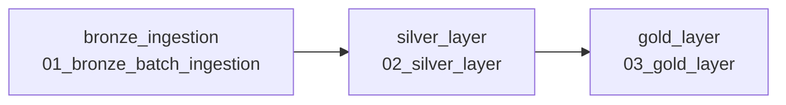

# ShopStream Architecture

## Overview

ShopStream is built on the Databricks Lakehouse platform using a medallion architecture. It has two parallel data paths: a batch path for historical data and a streaming path for live events. Both paths converge on Unity Catalog-governed Delta tables.

## Architecture Diagram

```mermaid
graph TD
    subgraph "Batch Path"
        CSV["Raw CSV files<br/>orders_2026_h1.csv<br/>customers.csv<br/>products.csv"] -->|COPY INTO| BRONZE["Bronze Delta Tables<br/>bronze_orders<br/>bronze_customers<br/>bronze_products"]
        BRONZE -->|Dedup, Clean, Type Cast| SILVER["Silver Delta Tables<br/>silver_orders<br/>silver_customers<br/>silver_products"]
        SILVER -->|Aggregate, Join| GOLD["Gold Delta Tables<br/>gold_daily_revenue<br/>gold_category_performance<br/>gold_customer_ltv"]
        GOLD -->|Query| DASH["AI/BI Dashboard"]
    end

    subgraph "Streaming Path"
        JSON["Live JSON Events"] -->|dbutils.fs.put| VOL["Events Volume<br/>/Volumes/shopstream/core/events/orders_stream/"]
        VOL -->|Auto Loader cloudFiles| STREAM["Streaming Bronze Table<br/>bronze_orders_stream"]
        VOL -->|Lakeflow Pipeline| PIPE_BRONZE["pipe_events_bronze<br/>STREAMING_TABLE"]
        PIPE_BRONZE -->|@dlt.table aggregation| PIPE_GOLD["pipe_daily_revenue<br/>MATERIALIZED_VIEW"]
    end
```

## Batch Path

### 1. Raw CSV → Bronze (Notebook: 01_bronze_batch_ingestion)

Three CSV files are stored in the Unity Catalog volume `shopstream.core.raw`:

* `orders_2026_h1.csv` — 13,717 order line records
* `customers.csv` — 1,000 customer profiles
* `products.csv` — 197 products

Each file is loaded using `COPY INTO` with schema inference and merge. The `COPY INTO` command is idempotent — Delta tracks which files have already been loaded, so re-running the notebook does not create duplicates.

Tables created:
* `shopstream.core.bronze_orders` — raw order lines
* `shopstream.core.bronze_customers` — raw customer profiles
* `shopstream.core.bronze_products` — raw product catalog

### 2. Bronze → Silver (Notebook: 02_silver_layer)

The Silver layer performs data quality remediation:

* **Deduplication:** 234 order line IDs were double-fired. `ROW_NUMBER() OVER (PARTITION BY order_line_id ORDER BY order_ts)` keeps only the first occurrence (`rn = 1`).
* **Bad data removal:** 259 rows with `quantity <= 0` are filtered out.
* **Type casting:** `quantity` → INT, `unit_price` → DOUBLE, `order_ts` → TIMESTAMP, `signup_date` → DATE.
* **Normalization:** `LOWER(status)` normalizes mixed-casing (`completed`/`COMPLETED`).
* **Derived columns:** `line_revenue = quantity * unit_price`, `unit_margin = unit_price - unit_cost`.
* **Null handling:** `NULLIF(coupon_code, '')` converts empty strings to NULL.
* **Delta DML:** `DELETE FROM silver_orders WHERE status = 'cancelled'` removes 2,167 cancelled orders. Time travel via `VERSION AS OF 0` preserves the pre-delete state for audit.

Tables created:
* `shopstream.core.silver_orders` — 11,061 clean order lines
* `shopstream.core.silver_customers` — typed customer dimensions
* `shopstream.core.silver_products` — typed product dimensions with margin

### 3. Silver → Gold (Notebook: 03_gold_layer)

Three Gold aggregation tables, all filtered to `status = 'completed'`:

* `gold_daily_revenue` — one row per day with order count, units sold, and revenue.
* `gold_category_performance` — revenue and gross margin by product category (joins `silver_orders` with `silver_products`).
* `gold_customer_ltv` — customer lifetime orders and revenue (joins `silver_orders` with `silver_customers`).

## Streaming Path

### Event Generation (Notebook: 04_stream_events)

A Python script simulates a live order feed:
* Generates 60 JSON files at 5-second intervals
* Each file contains 25 order events (1,500 total)
* Events include UUIDs, random product/customer IDs, quantities (weighted: 75% qty=1, 18% qty=2, 7% qty=3), prices, and timestamps
* 90% of events are `completed`, 10% are `cancelled`
* Files are written to `/Volumes/shopstream/core/events/orders_stream/`

### Auto Loader Ingestion (Notebook: 05_streaming_bronze)

Auto Loader (`cloudFiles` format) picks up new JSON files exactly once:
* `cloudFiles.format = json`
* `cloudFiles.schemaLocation` for schema evolution tracking
* `trigger(availableNow=True)` processes all available files in one micro-batch
* Checkpoint at `/Volumes/shopstream/core/events/_checkpoints/bronze_orders_stream`
* Writes to `shopstream.core.bronze_orders_stream`

### Lakeflow Spark Declarative Pipeline (shopstream_lakeflow)

The pipeline processes the live event stream using two `@dlt.table` definitions:

1. **`pipe_events_bronze`** (STREAMING_TABLE) — Reads JSON events from the events volume via Auto Loader. This is the streaming bronze table within the pipeline.
2. **`pipe_daily_revenue`** (MATERIALIZED_VIEW) — Aggregates completed events by date, computing event count and revenue. Depends on `pipe_events_bronze`.

Pipeline configuration:
* Photon enabled
* Serverless compute
* Storage: `shopstream.core` (managed tables in Unity Catalog)
* Libraries: Glob pattern matching `transformations/**/*.py`

## Job Orchestration

The `shopstream_daily_batch` job chains the three batch notebooks:



* **Schedule:** Daily, currently PAUSED
* **Run-as owner:** Enabled
* **Max concurrent runs:** 1
* **Performance target:** PERFORMANCE_OPTIMIZED
* **Queue:** Enabled

## Dashboard

The `ShopStream Sales` AI/BI Lakeview dashboard has two datasets registered:
* `gold_category_performance` → `shopstream.core.gold_category_performance`
* `gold_daily_revenue` → `shopstream.core.gold_daily_revenue`

The dashboard has a single page with GRID_V1 layout. **No widgets/visualizations have been placed on the canvas yet.**

## Unity Catalog Governance

All 12 tables, 2 volumes, and the schema are governed by Unity Catalog under the `shopstream` catalog:

```
shopstream (MANAGED_CATALOG)
└── core (schema)
    ├── bronze_orders (MANAGED)
    ├── bronze_customers (MANAGED)
    ├── bronze_products (MANAGED)
    ├── bronze_orders_stream (MANAGED)
    ├── silver_orders (MANAGED)
    ├── silver_customers (MANAGED)
    ├── silver_products (MANAGED)
    ├── gold_daily_revenue (MANAGED)
    ├── gold_category_performance (MANAGED)
    ├── gold_customer_ltv (MANAGED)
    ├── pipe_events_bronze (STREAMING_TABLE)
    ├── pipe_daily_revenue (MATERIALIZED_VIEW)
    ├── raw (VOLUME)
    └── events (VOLUME)
```

## Key Design Decisions

1. **COPY INTO for batch** — Idempotent, handles schema evolution via `mergeSchema`.
2. **ROW_NUMBER for dedup** — Deterministic: keeps the earliest occurrence by `order_ts`.
3. **Delta DELETE for business rules** — Leverages Delta transaction log and time travel for audit.
4. **Auto Loader with availableNow trigger** — Processes in micro-batches, cost-efficient for periodic processing.
5. **Lakeflow SDP for streaming** — Declarative approach with `@dlt.table` decorators, automatic lineage.
6. **Unity Catalog for all data** — Centralized governance, no external storage paths.
